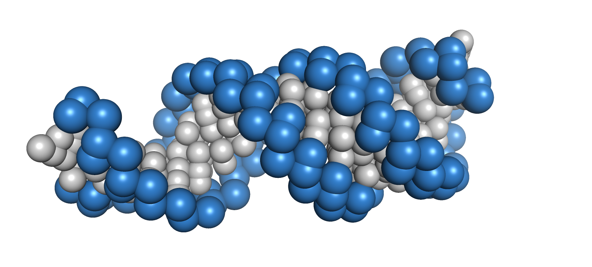

Why use reForge?
================

Need to simulate a large biomolecular complex? Or even many?
------------------------------------------------------------

Then reForge is the right tool. If offers a (*almost*) pain-free setup for Martini+CG Protein/RNA/Lipid complexes.

  .. image:: img/reforge_ribosome.png
     :alt: reForge Ribosome
     :scale: 50 %

- Kind of like here (https://www.nature.com/articles/s41467-024-53098-4)

Python-Based
------------

reForge is built entirely in *Python*, making it easy to use and integrate.

- **Simple Scripts:**  
  A couple of Python scripts are all you need. Whether you run tens or hundreds of MD simulations, 
  reForge handles it with just one button press.

Accelerated C- and CUDA Routines
--------------------------------

- **High Performance:**  
  Process terabytes of data with remarkable speed compared to standard Python and NumPy.

.. image:: img/reforge_speedup.png
   :alt: reForge Speedup Performance
   :scale: 60 %

This performance gain is impressive even for a medium-sized system of about 1000 residues. 
Imagine scaling up to hundreds or thousands of systems!

Tools for Custom Model Development
------------------------------------

Build your own models and integrate them with existing MD engines and analysis tools.

For New Users
-------------

- **Tutorials:**  
  Tutorials and examples that demonstrate basic workflows are provided with the package.

Indices and Tables
------------------

* :ref:`genindex`
* :ref:`modindex`
* :ref:`search`

